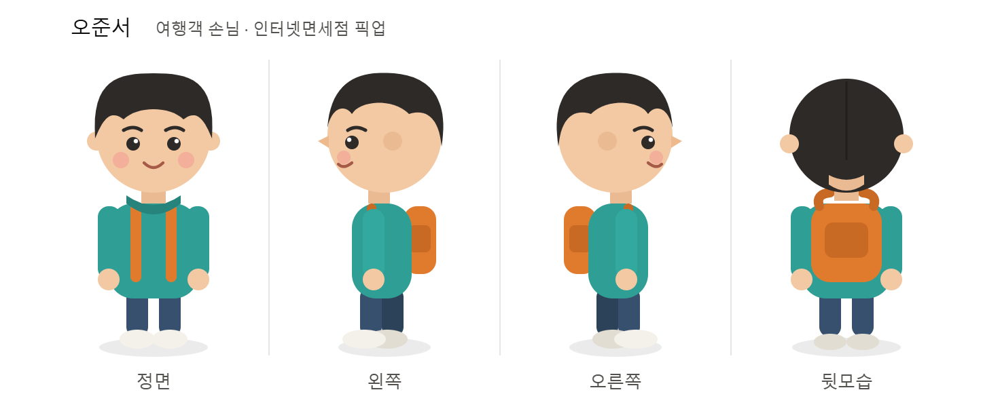
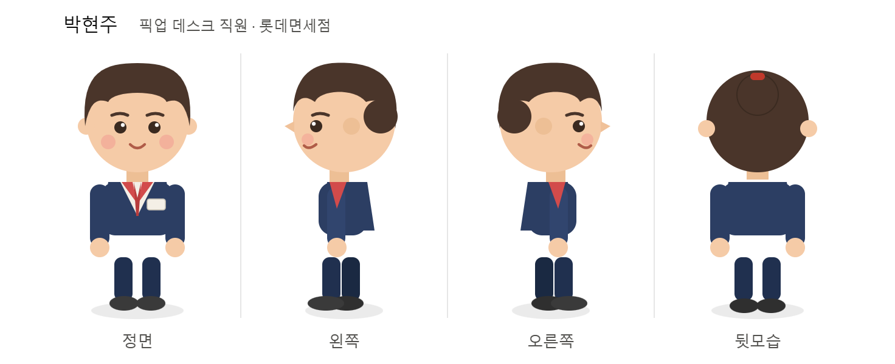
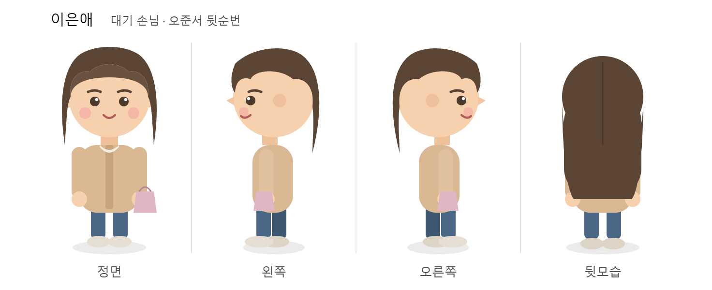

# 페르소나 에이전트 멀티 대화 시뮬레이션

Nemotron-Personas-Korea 데이터셋의 가상 주민을 LLM 에이전트로 만들어, 특정 상황에서 서로 대화·행동하게 하고 **상용 API 모델**과 **로컬 3B 모델**의 결과를 비교한 실험입니다.

---

## 1. 캐릭터

데이터셋에서 추출한 세 인물을 정면·왼쪽·오른쪽·뒷모습으로 시각화했습니다.

### 오준서 — 여행객 손님 (최애 주민)


### 박현주 — 픽업 데스크 직원


### 이은애 — 대기 손님 (오준서 뒷순번)


---

## 2. 시뮬레이션 설계

### 데이터셋
- **출처**: nvidia/Nemotron-Personas-Korea (HuggingFace, CC BY 4.0)
- **규모**: 100만 명의 한국인 가상 페르소나
- 각 주민은 나이·성별·직업·거주지 등 기본 정보와 상세한 페르소나 텍스트를 보유

### 등장 인물 (데이터셋에서 실제 추출)

| 이름 | 나이 | 직업 | 거주지 | 시뮬레이션 내 역할 |
|------|------|------|--------|-------------------|
| 오준서 | 24세 | 공연·영화 및 음반 기획자 | 충청남-계룡시 | 면세품을 찾으러 온 손님 (최애 주민) |
| 박현주 | 35세 | 그 외 상점 판매원 | 경기-광명시 | 면세점 픽업 데스크 직원 |
| 이은애 | 38세 | 무직 (주부) | 경기-김포시 | 오준서 뒷순번 대기 손님 |

### 상황 설정
> 롯데면세점 인터넷면세점 상품 수령 데스크. 오준서는 일본 여행을 앞두고 인터넷으로 구매한 면세품을 찾으러 왔다. 박현주는 이를 응대하는 직원이다. 이은애는 오준서 바로 뒷순번으로 자신의 물건을 찾기 위해 대기 중이다.

### 방법
- 각 주민의 페르소나 텍스트를 시스템 프롬프트로 주입하여 역할극 수행
- 성격을 임의로 지시하지 않고, **데이터셋 페르소나 원문과 최소한의 사실 정보(주문번호 등)만** 제공하여 캐릭터가 자율적으로 행동하도록 설계
- 서로 처음 만난 사이라는 점을 반영해, 대화 로그에서 이름 대신 역할(손님/직원)로 표시하여 본명을 미리 알지 못하게 함
- 손님은 볼일이 끝나면 대화를 종료하고 다음 손님으로 넘어가는 구조

### 비교 모델

| 구분 | 모델 | 실행 환경 |
|------|------|-----------|
| 상용 API | Llama-3.3-70B-Versatile | Groq API (클라우드) |
| 로컬 3B | Qwen2.5-3B-Instruct | Colab T4 GPU (로컬) |

---

## 3. 결과: 상용 API (Llama-3.3-70B)

- **오준서**: 저기요, 주문번호 25010번으로 선크림을 구매했는데 수령할 수 있을까요? *[주문을 확인하는 직원에게 친절하게 미소지으며 말함]*
- **박현주**: 네, 주문번호 25010번 선크림은 확인되었습니다. 잠시만요, 제가 확인한 후 상품을 찾아드리겠습니다. *[컴퓨터로 주문번호를 확인함]*
- **오준서**: 네, 감사합니다. 제가 오늘 일본에 여행을 가야 해서 오늘 꼭 받아야 해요. *[손목시계를 확인하며 조금 급한 표정]*
- **박현주**: 고객님, 확인 결과 선크림이 준비되어 있습니다. 잠시만 기다려주시면 상품을 찾아드리겠습니다. *[상품을 찾기 위해 창고로 이동]*
- **이은애**: 저기요, 주문번호 78030번으로 화장품 세트를 구매했는데 수령할 수 있을까요?
- **박현주**: 네, 주문번호 78030번 화장품 세트는 확인되었습니다. 잠시만 기다려주시면 상품을 찾아드리겠습니다.

*(총 8개 발언 후 종료)*

---

## 4. 결과: 로컬 3B (Qwen2.5-3B)

**턴 1**
- **오준서**: 저는 오준서입니다. 저 오늘 일본 여행 준비를 위해 인터넷으로 구매한 면세품을 찾아왔어요. 주문번호 25010번의 선크림을 찾을 수 있을까요? *[주문번호 확인]*
- **박현주**: 저는 박현주입니다. 고객님, 주문번호 25010번의 선크림을 찾겠습니다. *[주문번호 확인]*
- **이은애**: 저는 이은애입니다. 저도 오늘 인터넷으로 주문한 제품을 찾으러 왔어요. 주문번호 78030번의 화장품 세트를 찾습니다. *[주문번호 확인]*

**턴 2~3** (거의 동일한 발언 반복)
- 세 인물 모두 "저는 OOO입니다 … 주문번호 … 찾습니다"를 매 턴 반복
- 서로 이름을 모를 상황인데도 자기 이름을 계속 밝힘
- 행동이 "주문번호 확인" 하나로만 고정됨

---

## 5. 비교 분석

### 평가 항목별 비교

| 평가 항목 | 상용 API (Llama 70B) | 로컬 3B (Qwen2.5) |
|-----------|---------------------|-------------------|
| **역할 구분** (손님/직원) | 유지됨 — 손님은 요청, 직원은 조회·응대 | 형식적으로만 구분, 발화 패턴이 셋 다 유사 |
| **상황 진행** | 인사 → 확인 → 준비로 단계가 진행됨 | 매 턴 같은 자기소개·요청을 반복 (정체) |
| **대화의 유의미성** | 앞 발화에 반응하며 이어짐 | 서로 반응 없이 독백을 나열 |
| **행동 다양성** | 미소·시계 확인·창고 이동 등 다양 | "주문번호 확인" 한 가지로 고정 |
| **호칭 처리** | "저기요", "고객님"으로 자연스러움 | 매번 자기 이름을 밝힘 (처음 만난 설정과 모순) |
| **포맷 안정성** | 안정적 | "박현주: 박현주:" 식 이름 중복 출력 발생 |

### 페르소나 반영도

두 모델 모두 데이터셋 페르소나의 세밀한 개성(오준서의 기획자 성향, 박현주의 실속형 판매원 기질, 이은애의 바쁜 주부 특성)이 대사에 뚜렷하게 드러나지는 않았다. 다만 상용 API는 오준서가 "오늘 일본에 가야 해서 꼭 받아야 한다"며 시계를 확인하는 등 **상황에 맞는 감정과 동기를 자율적으로 표현**한 반면, 로컬 3B는 페르소나는 물론 상황적 맥락조차 반영하지 못하고 기계적인 요청만 반복했다.

성격 힌트를 별도로 주입하지 않고 페르소나 원문만 제공했기 때문에, "페르소나 텍스트만으로는 개성의 표면적 재현에도 한계가 있다"는 점이 드러난다.

### 유의미한 소통 여부

- **상용 API**: 손님의 요청 → 직원의 확인 → 상품 준비로 이어지는 자연스러운 응대 흐름이 형성되었고, 오준서가 여행 일정을 이유로 서두르는 등 맥락 있는 상호작용이 나타났다.
- **로컬 3B**: 세 에이전트가 서로의 발화에 반응하지 않고 거의 동일한 자기소개와 요청을 반복하여, 상호작용이라기보다 **독백의 나열**에 가까웠다.

---

## 6. 결론

동일한 페르소나와 상황을 제공했을 때, **모델 규모에 따른 시뮬레이션 품질 차이가 뚜렷하게 나타났다.**

상용 API(70B)는 역할 구분, 상황 진행, 맥락 있는 반응 등 멀티 에이전트 시뮬레이션의 기본 요건을 안정적으로 충족했다. 반면 로컬 3B는 역할·상황 이해가 얕고 동일 발언을 반복하여 유의미한 상호작용을 만들어내지 못했다.

다만 **페르소나의 세밀한 개성 반영**이라는 측면에서는 상용 API조차 표면적 재현에 그쳤다. 이는 페르소나 원문 주입만으로는 부족하며, 추가적인 성격 강조 프롬프트나 파인튜닝이 필요함을 시사한다.

또한 대화 구조를 여러 방식으로 조정하는 과정에서, 순서를 고정하면 대화가 제자리에서 맴돌고, 발언 순서를 모델에 맡기면 특정 인물이 독점하는 등 **구조를 손볼수록 다른 부작용이 나타나는** 현상도 관찰되었다. 이는 정해진 순서로 번갈아 발화하는 멀티 에이전트 방식이 사람의 자연스러운 대화 리듬을 재현하기 어렵다는 근본적 한계를 보여준다.

---

## 파일 구성

```
submit/
├── README.md                      # 본 리포트
├── simulation.ipynb      # 전체 코드 및 실행 결과
└── characters/                    # 캐릭터 일러스트
    ├── ojunseo.png
    ├── parkhyunju.png
    └── eeunae.png
```
