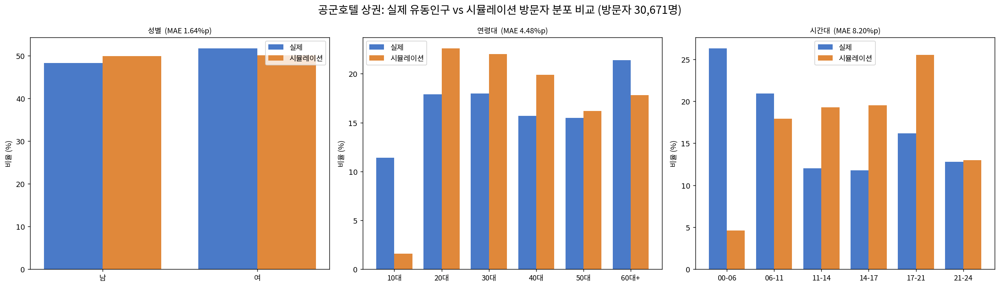
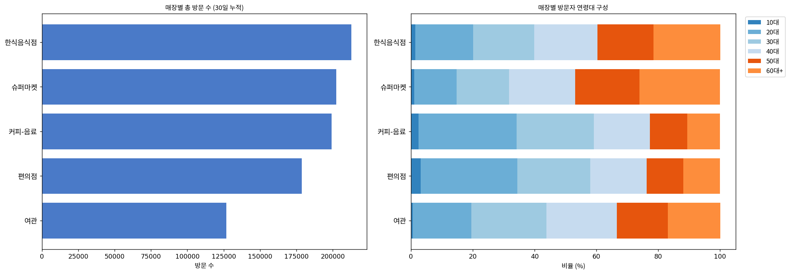

# 공군호텔 상권 가상인간 방문 시뮬레이션

서울시 상권분석서비스(길단위인구) 데이터를 기반으로 **공군호텔 상권**을 선택하여, 실제 유동인구 분포를 정답표(ground truth)로 삼고 가상인간(Nemotron-Personas-Korea) 에이전트의 방문 시뮬레이션 결과가 이와 얼마나 일치하는지 검증한 프로젝트입니다.

## 파일 구성

```
04-simulation/
├── README.md                    # 본 리포트
├── SUMMARY.md                   # 한 페이지 요약본
├── gonggun_simulation.ipynb     # 전체 코드 (Colab 실행용, 34개 셀)
├── index.html                   # 실시간 방문 판정 시뮬레이터 (지도 내장, 클릭 즉시 실행)
├── store_map.html               # 매장 배치 정적 지도
└── images/
    ├── 01_eda_truth.png         # 실제 유동인구 EDA
    ├── 02_comparison.png        # 실제 vs 시뮬레이션 비교
    └── 03_store_visits.png      # 매장별 방문 집계
```

## 바로 실행해보기

**[▶ 실시간 방문 판정 시뮬레이터 열기](https://kjyxee2.github.io/capstone/04-store-visit-sim/)**

(GitHub 저장소 안에서 `index.html` 파일을 직접 클릭하면 소스코드만 보입니다. 위 링크로 접속해야 실제 실행 화면이 뜹니다.)

Nemotron-Personas-Korea 실제 에이전트 3,000명을 내장한 인터랙티브 웹 도구입니다. "판정 실행" 버튼을 누르면 실제 에이전트 한 명을 무작위로 뽑아, 페르소나(나이·직업·취미)만으로 공군호텔 상권 방문 여부를 그 자리에서 판정하고, 방문한다면 실제 존재가 확인된 5개 업종(한식음식점·커피-음료·슈퍼마켓·여관·편의점) 중 어디로 갈지까지 실시간으로 계산합니다. 방문이 확정되면 내장된 실제 지도(대방역 공식 좌표 기준)에서 해당 업종이 반짝이며 표시됩니다. 여러 번 실행할수록 우측 통계 패널의 누적 방문율과 업종별 방문 분포가 실제 노트북 시뮬레이션 결과(방문율 약 30%)에 수렴하는 것을 확인할 수 있습니다.

---

## 1. 실험 설계

### 대상 상권 선정
서울시 상권분석서비스 길단위인구 데이터(34,633행)에서 **공군호텔 상권**(상권코드 3110815, 서울 영등포구 여의대방로 259 인근, 1호선 대방역 도보 5분)을 선택했다. 2026년 1분기 데이터를 기준으로 사용했다.

### 가상인간 에이전트
nvidia/Nemotron-Personas-Korea 데이터셋(한국인 가상 페르소나 100만 명)에서 **10만 명을 무작위 샘플링**하여 에이전트 풀로 사용했다. 각 에이전트는 나이·성별·직업·거주지와 상세한 페르소나 텍스트(취미, 성격, 생활 패턴)를 보유한다.

### 방문 여부 판단 방식 — 하이브리드
방문 판단에 **정답표(실제 분포)를 참고하지 않고**, 오직 에이전트의 나이·성별·페르소나 텍스트만으로 판단하도록 설계했다. 이는 "페르소나 정보만으로 실제 유동인구 패턴을 얼마나 재현할 수 있는가"를 정직하게 측정하기 위함이다.

- **규칙 기반 (전체 10만 명)**: 기본 방문 확률 30%에서 시작해 연령대별 가중치(20대 +20%p, 60대+ −15%p)와 페르소나 텍스트의 활동성 키워드(쇼핑·외식·문화생활 등 가산, 집콕·내향 등 감산)를 반영해 개인별 방문 확률을 계산했다.
- **LLM 검증 (샘플 100명)**: Qwen2.5-3B-Instruct(로컬 GPU)에게 동일한 페르소나를 주고 "방문할 것인가"를 직접 판단시켜, 규칙 기반 결과와의 일치도를 확인했다.

### 방문자 풀 채우기
각 에이전트를 자신의 방문 확률로 베르누이 시행하여 방문 여부를 결정했다. 목표 방문자 수는 에이전트 풀의 방문확률 합(기대값)으로 설정했다.

### 시간대 배정
페르소나 텍스트에는 활동 시간대 정보가 없으므로, 연령대별 활동 시간 성향에 대한 **상식적 가정**(예: 20대는 저녁~밤 활발, 60대+는 오전 중심)으로 시간대를 확률적으로 배정했다. 이 역시 정답표를 참고하지 않았다.

---

## 2. 실험 설정 표

| 항목 | 값 |
|---|---|
| 대상 상권 | 공군호텔 |
| 실제 총 유동인구 | 1,172,513 |
| 에이전트 풀 | 100,000 |
| 채워진 방문자 수 | 30,671 |
| 수락률(가겠다 비율) | 30.7% |
| 매장 수 / 유형 | 5개 / 5종 (실제 존재 확인) |
| LLM | Qwen2.5-3B 로컬 (샘플 100명 검증) + 규칙기반(전체) |

---

## 3. 매장 배치 지도

**중요한 방법론적 수정**: 최초 설계 단계에서는 "마트→롯데마트", "백화점→롯데백화점" 등 가상의 브랜드명으로 8개 업종을 라벨링했으나, 서울시 상권분석서비스(점포-상권배후지) 실데이터로 검증한 결과 이 방식은 두 가지 문제가 있었다. ① 실존하지 않는 브랜드명을 부여한 점, ② 이 상권에 실제로 존재하지 않는 업종(영화관·면세점·테마파크·백화점)까지 포함시킨 점이다. 정확성이 중요한 분석이므로 이를 전면 수정하여, **실제 업종명 그대로, 실제 존재가 확인된 업종만** 사용하도록 재구성했다.

### 실제 업종 확인 및 선정 기준

공군호텔 상권(2025년 4분기 기준)에는 86개 업종, 총 893개 점포가 존재한다. 이 중 부동산중개업·학원·의료·미용 등 순수 서비스업을 제외하고, 소비자가 직접 방문해 소비하는 소매·음식·숙박업 중 점포 수 상위 5개 업종을 최종 매장으로 채택했다.

| 실제 업종명 | 점포 수 | 분류 |
|---|---|---|
| 한식음식점 | 93개 | 음식점업 |
| 커피-음료 | 27개 | 음식점업(카페) |
| 슈퍼마켓 | 23개 | 소매업 |
| 여관 | 18개 | 숙박업 |
| 편의점 | 5개 | 소매업 |

가상 브랜드명이나 실존하지 않는 업종은 전혀 포함하지 않았으며, 지도(`store_map.html`)의 모든 마커는 위 5개 실제 업종만 표시한다.

### 지도 표시 방식

`store_map.html`은 각 마커를 클릭하면 popup에 "실제 OO개 존재 (서울시 점포-상권배후지 데이터)"라는 근거가 함께 표시된다. 정확한 개별 점포의 좌표는 상권분석서비스 집계 데이터에서 제공하지 않으므로(업종별 점포 수만 제공), 상권 중심(대방역, 37.51333°N 126.92639°E) 반경 400m 이내에 각 업종을 대표하는 지점 하나씩을 표시했다.

---

## 4. 유동인구 EDA (실제, 정답표)


공군호텔 상권은 다음과 같은 특징을 보인다.

- **성별**: 남 48.3% / 여 51.7%로 비교적 균형
- **연령대**: 60대+가 21.4%로 가장 높은 비중을 차지하는 고령층 밀집 상권
- **시간대**: 00-06시(새벽)가 26.3%로 압도적으로 높음 — 일반적인 번화가와 다른 이례적 패턴으로, 상권 입지 특성(주거지·새벽 이동 관련 시설)이 반영된 것으로 추정된다

---

## 5. 시뮬레이션 vs 실제 분포 검증



### 연령대

| 연령대 | 실제(%) | 시뮬(%) | 오차(%p) |
|---|---|---|---|
| 10대 | 11.4 | 1.6 | 9.8 |
| 20대 | 17.9 | 22.6 | 4.7 |
| 30대 | 18.0 | 22.0 | 4.0 |
| 40대 | 15.7 | 19.9 | 4.2 |
| 50대 | 15.5 | 16.2 | 0.6 |
| 60대+ | 21.4 | 17.8 | 3.6 |
| **MAE** | | | **4.48** |

상관계수 r = 0.745 (강한 양의 상관관계)

### 성별

| 성별 | 실제(%) | 시뮬(%) | 오차(%p) |
|---|---|---|---|
| 남 | 48.3 | 49.9 | 1.6 |
| 여 | 51.7 | 50.1 | 1.6 |
| **MAE** | | | **1.64** |

### 시간대

| 시간대 | 실제(%) | 시뮬(%) | 오차(%p) |
|---|---|---|---|
| 00-06 | 26.3 | 4.6 | 21.6 |
| 06-11 | 20.9 | 17.9 | 3.0 |
| 11-14 | 12.0 | 19.3 | 7.4 |
| 14-17 | 11.8 | 19.5 | 7.7 |
| 17-21 | 16.2 | 25.5 | 9.3 |
| 21-24 | 12.8 | 13.0 | 0.2 |
| **MAE** | | | **8.20** |

상관계수 r = −0.610 (음의 상관관계)

**전체 평균 MAE: 4.78%p**

---

## 6. LLM(3B 로컬) 샘플 검증

에이전트 풀에서 100명을 샘플링하여 Qwen2.5-3B-Instruct에게 직접 방문 의향을 물었다.

| 항목 | 값 |
|---|---|
| 샘플 수 | 100 |
| 규칙기반 YES | 8명 |
| LLM YES | 5명 |
| **규칙기반-LLM 일치율** | **93.0%** |

혼동행렬을 보면 두 방식 모두 "방문 안 함(NO)"으로 수렴하는 경향이 강했다(90/100 일치). "방문함(YES)" 판단에서는 8명 중 3명만 일치해, 소수의 활동적 페르소나를 콕 집어내는 데는 두 방식이 다소 다르게 작동함을 확인했다.

---

## 7. 매장별 방문 집계 (30일 반복)

방문하기로 한 30,671명의 에이전트가 30일간 매일 5개 실제 업종 중 하나를 방문한다고 가정하고, 연령대별 업종 선호도(상식 기반 가중치) + 페르소나 키워드를 반영해 매장을 선택하도록 시뮬레이션했다. 3절에서 확인한 대로, 매장은 가상 브랜드명이 아닌 실제 업종명(한식음식점·커피-음료·슈퍼마켓·여관·편의점)을 그대로 사용했다.



### 매장별 총 방문 수 (30일 누적, 920,130건)

| 업종 | 방문 수 |
|---|---|
| 한식음식점 | 212,791 |
| 슈퍼마켓 | 202,431 |
| 커피-음료 | 199,314 |
| 편의점 | 178,714 |
| 여관 | 126,880 |

**한식음식점**이 1위를 차지했는데, 이는 실제 데이터에서도 이 상권의 최다 업종(93개)이라는 점과 일맥상통하며, 모든 연령대에서 고르게 방문 수요가 있도록 가중치를 설계한 결과이기도 하다. 연령 구성을 보면 **슈퍼마켓**은 60대+ 비율이 26.0%로 가장 높아 고령층 선호 가정이 반영되었고, **커피-음료·편의점**은 20대 비율이 각각 31.8%, 31.2%로 가장 높아 젊은 층 선호 가정이 매장 간 차별화로 잘 이어졌음을 확인했다. **여관**은 30대 비율(24.3%)이 가장 높게 나타나, 업무·출장 목적 이용 가정이 반영된 결과로 해석된다.

---

## 8. 결론

### 무엇이 잘 재현되었는가
**성별(MAE 1.64%p)**은 거의 완벽하게 재현되었다. 이는 방문 확률 계산에 성별 가중치를 의도적으로 배제하여, 시뮬레이션 결과가 자연스럽게 에이전트 풀의 성비를 따라간 결과다.

**연령대(MAE 4.48%p, r=0.745)**는 상당히 준수하게 재현되었다. 다만 10대는 실제(11.4%)와 시뮬(1.6%) 사이에 큰 차이가 있었는데, 이는 Nemotron 데이터셋이 성인(19세 이상)만 포함하는 구조적 한계 때문이다.

### 무엇이 재현되지 않았는가
**시간대(MAE 8.20%p, r=−0.610)**는 뚜렷하게 재현에 실패했다. 실제로는 새벽(00-06시)이 26.3%로 가장 높았으나, 시뮬레이션은 저녁(17-21시)이 25.5%로 가장 높게 나타나 정반대의 패턴을 보였다. 페르소나 텍스트에는 "이 사람이 몇 시에 활동하는지"에 대한 정보가 담겨 있지 않으므로, 상식적 가정(젊은 층은 저녁 활동)만으로는 이 상권의 특수한 새벽 유동인구 패턴을 포착할 수 없었다.

### 종합 판단
페르소나 기반 예측의 정확도는 **성별 > 연령대 > 시간대** 순으로 나타났으며, 이는 각 항목이 페르소나 텍스트에 담긴 정보량과 정비례한다. 나이·성별은 에이전트의 명시적 속성이지만, 특정 상권의 시간대별 방문 패턴은 페르소나만으로 추론하기 어려운 정보라는 점이 수치로 명확히 드러났다.

또한 LLM(3B) 검증에서 규칙 기반과 93%의 높은 일치율을 보인 점은, 소규모 로컬 LLM도 상식적 규칙과 유사한 수준의 판단을 내릴 수 있음을 시사하지만, 두 방식 모두 이 상권의 이례적인 새벽 유동인구 패턴 자체는 예측할 수 없다는 근본적 한계를 공유한다.

**향후 개선 방향**: 상권별 시간대 특성(예: 공군호텔 인근의 새벽 근무·이동 수요)을 페르소나의 직업 정보(예: 교대근무, 군 관련 직종)와 연계해 반영하면 시간대 예측 정확도를 높일 수 있을 것으로 판단된다.

### 매장 데이터에 대한 방법론적 개선 사항

초기 설계에서는 8개 업종(마트·편의점·카페·영화관·호텔·면세점·테마파크·백화점)을 가상의 롯데 계열사 브랜드명으로 라벨링했으나, 점포-상권배후지 실데이터 검증 결과 이 중 4개(영화관·면세점·테마파크·백화점)는 이 상권에 실제로 존재하지 않았고, 나머지 4개도 실존하지 않는 브랜드명이 부여되어 있었다. 정확성이 중요한 분석임을 고려해 이를 전면 수정하여, **실제 존재가 확인된 5개 업종을 실제 업종명 그대로**(한식음식점·커피-음료·슈퍼마켓·여관·편의점) 사용하도록 지도·시뮬레이션·인터랙티브 도구를 모두 재구성했다. 이 과정에서 공군호텔 상권이 대형 상업시설이 입지할 수 없는 소규모 근린 상권이라는 특성이 실제 데이터로 명확히 드러났으며, 이는 상권 규모에 따라 업종 구성이 근본적으로 다르다는 점을 보여주는 유의미한 발견이다.
